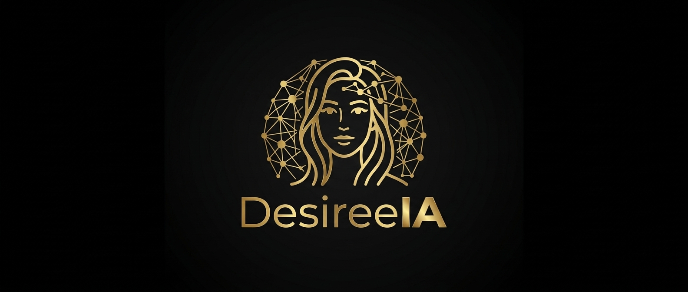

# DesireeIA
[](#)
[](#)

We are currently in **Beta 0.1**, actively building, testing, and stabilizing the platform.

> **Beta 0.1 Notice:** DesireeIA is under active development. Features, APIs, and infrastructure are being continuously refined for stability, efficiency, and overall performance.

---

A local large language model inference engine for the .NET ecosystem: a native C++17 core exposed through a stable C ABI, with an idiomatic .NET wrapper on top.

## What it does

DesireeIA loads quantized language models from disk and runs them entirely on local hardware — no network calls, no external services. It targets practical CPU throughput while auto-adapting its execution plan to the hardware it's running on.

## Background

This project started in 2023, out of a simple need: a local inference engine we actually owned, built primarily for the .NET ecosystem and, from the outset, designed to be usable from other technologies too rather than locked into one runtime. Going straight to C++ for the core was a deliberate choice from day one — it's what gives the engine tight control over memory, the best achievable performance on ordinary hardware, and the broadest possible portability across platforms. That decision built on real prior experience with local AI: by that point we'd already evaluated and run thousands of GGUF models from the Hugging Face ecosystem, so the engine's design started from a working understanding of what actually mattered in practice, not from a blank slate.

The project was set aside for a while as other priorities took over, but it came back into focus with the development of a personal AI assistant — Kodinn IA, originally called Offgrid — which needed to run primarily on local models. Development resumed, running alongside the rest of that assistant's libraries rather than as the main focus, until it reached the point of being split out and developed as its own project in the shape it's in today.

## Supported model formats

- **GGUF**
- **safetensors**, including models with Mixture-of-Experts weights streamed from disk

## Supported architectures

Dense causal transformers (RoPE, grouped-query attention, gated/non-gated feed-forward), with per-family behavior handled through a quirks system rather than one implementation per model:

- Gemma, Gemma 2, Gemma 3
- Qwen, Qwen 2, Qwen 3 (+ Qwen2-MoE)
- Mistral and the broader Llama-shaped family (InternLM2, Exaone, SmolLM3, Nanbeige, Baichuan, XVerse, PLaMo, Refact, PanGu-Embedded)
- SeedOss, StableLM, Orion
- Starcoder2 (+ CodeShell), Nemotron, Arcee
- Olmo2, Exaone4 (post-norm topology)
- Cohere2, Falcon (parallel attention/FFN topology, fused QKV)
- GPT-2, BLOOM, MPT (absolute position embeddings / ALiBi, no RoPE)
- Spark2_5 (hybrid sliding-window attention: per-layer flag array rather
  than a fixed period, dual RoPE — full rotation with one base on
  sliding-window layers, partial rotation with a different base on full
  layers — fused QKV, and a per-head sigmoid output gate)

Beyond the dense family:

- **DeepSeek2** — Multi-head Latent Attention (compressed KV cache, absorbed projections), Mixture-of-Experts with a shared-expert branch and sigmoid gating, YaRN rope scaling
- **Mamba2** — pure state-space model (selective scan, causal depthwise convolution, constant-size recurrent state instead of a growing KV cache)
- **BERT** — encoder-only, bidirectional attention, post-norm topology, per-token embedding output (no next-token generation)

Mixture-of-Experts models route through a tiered expert store (see below) rather than holding every expert in RAM at once.

## Multimodal (vision)

When the loaded GGUF carries `clip.vision.*` metadata, the CLIP-style vision
encoder (patch embedding, transformer layers, projection) is loaded
automatically at `LocalModel.Load()` time — no extra setup. Images are
understood, not generated: this covers vision *input* (an image is encoded
into embedding vectors and injected at the model's image placeholder token,
so the text model can answer questions about it), not image or video
generation, and not video understanding (no frame decoding is implemented).

```csharp
if (model.HasVision)
{
    using var image = LocalModel.LoadImage("photo.png");
    var embd = model.EncodeImage(image, out var dim);
    var token = model.PredictWithImage(promptTokens, embd!);
}
```

The CLI's `chat` command exposes this through `/image <path> [question]`.

## Engine architecture

Three layers:

1. **Native core** (C++17, C ABI) — hardware probe, execution planner, quantized matrix kernels, model forward paths, GGUF/safetensors readers, KV cache, tokenizers (SentencePiece Unigram and byte-level BPE), sampler, chat template formatting.
2. **Hardware adaptation layer** — probes the machine and builds an execution plan (thread count, RAM budget, quantization target, backend) before any model is loaded.
3. **.NET wrapper** — P/Invoke bindings plus idiomatic C# types over the native ABI.

### Startup flow

```
DetectHardware()  ->  BuildPlan(modelPath, overrides)  ->  LocalModel.Load(...)
       |                        |                                |
  native hw probe        execution plan                native context + reader
```

At load time the engine:

1. Detects hardware (physical CPU core count — hyperthread siblings are not
   counted as extra cores, since the AVX2 kernels here are memory-bound and
   two threads sharing a physical core's L1/L2 contend rather than add
   throughput —, AVX/AVX2/AVX512/NEON, CUDA/Intel Arc/Metal/NPU acceleration,
   RAM). NUMA topology is not currently detected.
2. Builds an execution plan automatically unless the caller overrides it (RAM budget, thread count, quantization, format).
3. Applies tiered caching for MoE experts:
   - experts streamed from disk with an LRU cache,
   - a learned hot-set (frequently used experts pinned, persisted alongside the model),
   - one-layer-ahead expert prefetch,
   - batch-union expert fetching (each unique expert read once per batch of positions),
   - optional dual-SSD mirroring.

Every part of the plan can be overridden by the caller.

### Storage tier

Models larger than the RAM budget can be served straight from disk instead of
being loaded whole. The tier is configurable per load:

| Mode | Behaviour |
| --- | --- |
| `Off` | Weights are served from RAM only. |
| `Auto` (default) | The tier engages only when the weights do not fit the budget. |
| `Always` | Weights are always streamed, even when they would fit. |

`Auto` decides from a real budget rather than a flat percentage: a system
reserve is left to the operating system, a runtime reserve covers the KV cache,
activations and per-layer dequantization scratch, and the weights are compared
against what remains. A model that fits stays entirely on the RAM path, and the
tier is not constructed at all — nothing sits on the tensor read path and
throughput is unchanged.

The tier never parses the model file itself; it serves misses through the same
reader the rest of the engine uses, so both paths see identical bytes.

```csharp
var plan = new ExecutionPlan
{
    SsdTier = SsdTierMode.Always,
    SsdTierCacheMb = 2048
};
```

`DESIREEIA_SSD_TIER=off|auto|always` overrides the mode for a single run.

### Weight requantization

Decode is bandwidth-bound: every weight is read once per token and the
arithmetic per byte is small, so time spent tracks bytes moved. Q6_K tensors
can optionally be rewritten as Q4_K while loading, which moves about 31% fewer
bytes for those tensors.

This is off by default. It is a quality trade, not a free win, and one the
model's author already weighed — a Q4_K_M file keeps the output projection at
Q6_K precisely because it is the tensor most sensitive to 4-bit. Enable it with
`DESIREEIA_REQUANT_Q6K=1` and measure on your own model.

The quantizer fits each sub-block by minimizing squared reconstruction error
(alternating nearest-level assignment with the closed-form least-squares
regression of the values on their levels, over several starting ranges) rather
than simply spanning min to max, and applies the same treatment to the shared
6-bit scales. The self-test asserts it beats a plain min/max fit.

### KV cache quantization

The KV cache can optionally be stored as Q8_0 (32-value sub-blocks, one fp16
scale each) instead of float32 — roughly 3.76x smaller. Only applies to the
classic (non-MLA) attention path; an MLA model's own compressed latent cache
is already far smaller than a classic per-head cache, so this doesn't touch it.

Off by default, and not just out of caution: measured at 48 and ~400 tokens
of context on this project's own benchmark, it was 15-24% *slower*, not
faster — at those lengths the float cache already fits comfortably in CPU
cache, so there's no real memory-bandwidth pressure to relieve, and every
read pays a real int8-to-float decode cost with nothing to show for it. The
crossover point where a smaller cache would start winning, if there is one
on typical hardware, needs a much longer context than what's been tested
here. Enable it with `DESIREEIA_KV_QUANT=1` to measure on your own
workload — long-context use is the case worth trying it on.

### Memory locking

The largest weight tensors (the token embedding, and the output head when a
model has a separate one) can optionally be locked resident with the OS —
`VirtualLock` on Windows, `mlock` on Linux/macOS, both with a best-effort
attempt to raise the platform's default quota first, since either API simply
fails outright on a multi-hundred-MB range under the out-of-the-box limit.
Failure is silent and non-fatal: an unprivileged process keeps its weights
either way, just without a guarantee against a swap stall mid-decode under
memory pressure.

This is deliberately partial: the per-layer weights are not locked (that
would mean walking every tensor across every layer, real additional work, not
done here), only the embedding/output head. Enable with `DESIREEIA_MLOCK=1`.

### Recover-LoRA adapters

DesireeIA can apply LoRA adapters at runtime on top of a frozen (quantized)
base model, without ever merging them into the base weights. This recovers
most of the quality lost to quantization when the adapter was trained for
that purpose (Recover-LoRA:
distillation from an FP teacher against the int4 base), but works with any
standard LoRA adapter converted to this format.

Applied per weight tensor, on top of the base matmul, base weight untouched:

```
out = base_mm(x, W) + scale * B @ (A @ x)          scale = user_scale * alpha / rank
```

**Adapter file format** — a separate GGUF file, desireeialmn's convention
(a PEFT checkpoint can be converted to it with desireeialmn's
`convert_lora_to_gguf.py`):

- for every fine-tuned base tensor `<name>`, two tensors:
  `<name>.lora_a` (`[rank, cols]`) and `<name>.lora_b` (`[rows, rank]`);
- optional metadata `adapter.lora.alpha` (f32) — classic PEFT `alpha/rank`
  scaling, multiplied by the caller-supplied scale;
- optional `adapter.type` (must be `"lora"` if present).

Multiple adapters can be loaded at once; their contributions simply add.

**Scope**: attention (`wq`/`wk`/`wv`/`wo`), dense/MLA FFN (`wff_*`,
`wq_a`/`wq_b`/`wq_lite`/`wkv_a_mqa`), shared-expert FFN, the router, and the
output head — covering every dense/MLA architecture this engine supports.
**Not yet covered**: routed MoE experts (a different code path/tensor
layout — see `expert_ffn`), the fused-QKV tensor (falcon), and MLA's
absorbed per-head `wk_b_h`/`wv_b_h` (a dedicated fast path that bypasses the
matmul dispatcher these deltas hook into). An adapter targeting those
tensors is simply a no-op there, not silently wrong.

```csharp
model.LoadLoraAdapter("path/to/adapter.gguf", scale: 1.0f);
// ... generate ...
model.ClearLoraAdapters();
```

CLI: `--lora <adapter.gguf>` / `--lora-scale <f>` on `generate`, `bench`,
and `chat`. `DESIREEIA_LORA_PATH` / `DESIREEIA_LORA_SCALE` set the default
when the flags aren't passed — same parametrization pattern as every other
`DESIREEIA_*` env var here.

```powershell
desireeia-cli chat model.gguf --lora adapter.gguf --lora-scale 1.0
```

### Real SSD-expert overlap and prerouter prediction

MoE models whose experts stream from disk (the fallback path used when a
layer's experts aren't fully resident/stacked in RAM — see "Storage tier"
above) fetch each selected expert's weights on a background worker thread
instead of blocking the calling thread inline. This is separate from —
and a prerequisite for — routing prediction:

- **Baseline overlap** (always on, no configuration needed): the instant a
  layer's own router resolves its selected experts, their weights start
  loading in the background while the engine finishes whatever compute
  came before that point; by the time each expert's matmul actually needs
  the data, it's often already resident instead of a cold blocking read.
- **Prerouter prediction** (opt-in): additionally predicts, from a
  trained per-layer head, which experts the *next* layer is likely to
  route to, and starts loading those a full layer earlier than the
  baseline case above. No trained head is published for any model
  supported here yet, so a documented heuristic fallback is available
  instead — "the next layer routes to the same experts this layer just
  used" — a naive placeholder, not a claim of real accuracy.

```csharp
model.LoadPrerouter("path/to/prerouter.gguf");  // trained heads, when one exists
model.SetPrerouterHeuristic(true);              // or: naive fallback, no file needed
```

CLI: `--prerouter <file.gguf>` / `--prerouter-heuristic` on
`generate`/`bench`/`chat`; `DESIREEIA_PREROUTER_PATH` /
`DESIREEIA_PREROUTER_HEURISTIC=1` env var defaults, same pattern as
`--lora`. A prerouter file uses this engine's own GGUF tensor-naming
convention (`prerouter.<owner_layer>.fc1.weight` / `.fc2.weight` /
`.linear_init.weight`) — there is no published external file in this
format to load; the mechanism exists so a head trained specifically for
this engine can be dropped in later.

Neither mechanism ever affects correctness: a missed or wrong prediction
simply means the pre-existing (still correct) fetch path runs when the
data is actually needed.

## Hardware backends

Backends are probed and the strongest available one is selected automatically, in priority order:

1. NPU acceleration (vendor SDK)
2. NVIDIA CUDA
3. Intel Arc (Level Zero)
4. Metal (Apple Silicon)
5. CPU (always available — scalar fallback if AVX2 isn't present)

### CUDA backend

No external library is required to *use* CUDA acceleration — the whole
backend is compiled into `DesireeIALocaleEngine.dll`/`.so` itself
(`DESIREEIA_ENABLE_CUDA` build flag). Nothing needs to be installed beyond
an NVIDIA driver; the engine detects a compatible device at startup and
switches backend automatically, with the CPU path always kept as the
correct, always-available fallback.

**What it does, entirely on the GPU, per token:**

- Every quantized weight format used by real GGUF checkpoints has a direct
  device kernel — no dequantize-then-multiply detour: Q4_0, Q4_1, Q5_0,
  Q5_1, Q8_0, Q4_K, Q5_K, Q6_K.
- Weights are **device-resident**: uploaded once at load time, never
  re-transferred per token.
- The KV cache lives on the device (Q8_0-quantized), mirrored to the host
  only where the rest of the engine needs to read it.
- **One CUDA Graph per transformer layer** — attention, both projections,
  RoPE, the KV-cache write and the gated FFN captured as a single graph
  node chain. `x` crosses the whole stack of layers on device with a
  single host↔device round trip per generated token, instead of one per
  kernel.
- Multiple small matrix-vector products that share an activation (Q/K/V,
  the FFN's gate+up pair, a per-head attention gate where the architecture
  has one) are dispatched as **one grouped kernel launch** rather than
  several small ones — a small projection alone doesn't fill a modern GPU,
  grouping does.
- Every one of the above is validated against the CPU reference path in
  this project's self-test; a CUDA kernel that cannot be validated for a
  given shape falls back to CPU automatically rather than producing an
  unchecked result.

**Measured** (RTX 1000 Ada, 6 GB, 96-bit memory bus — a laptop-class GPU,
not a data-center card; streaming bandwidth measured directly at 164 GB/s
against a 192 GB/s spec sheet, which is the real ceiling decode speed is
bound by):

| Model | Quantization | CPU decode | CUDA decode | Speedup |
| --- | --- | --- | --- | --- |
| Gemma 2B IT | Q4_K_M | 27.2 tok/s | **82.5 tok/s** | 3.0x |
| Spark-X2.5 4B | Q4_K_M | 17.2 tok/s | **50.2 tok/s** | 2.9x |

Force a backend explicitly with `--backend cpu|cuda` on the CLI, or leave
it on auto-detection (the default).

```powershell
desireeia-cli bench model.gguf --backend cuda --tokens 32
```

## Generation features

Beyond plain `Predict`/`NextToken`, the .NET wrapper offers:

- **Async streaming** — `LocalModel.StreamAsync`/`ChatStreamAsync` return an
  `IAsyncEnumerable<string>` with `CancellationToken` support, instead of a
  blocking token loop. The native engine call itself stays synchronous (one
  mutex per context serializes it anyway); streaming here is cooperative
  (`await Task.Yield()` between tokens) so the caller can interleave other
  async work and observe cancellation token-by-token.
- **Stop sequences** — `GenerateOptions.StopSequences` stops generation the
  moment any of the given strings appears, trimming it out of the output,
  even when the sequence spans more than one decoded piece.
- **Tool calling** (`ToolCalling`) — prompt-based: builds a system prompt
  describing the available tools and parses a `<tool_call>{...}</tool_call>`
  block from the response. This is not native function-calling — reliability
  depends on the model actually following the instruction — and tool
  results are re-appended to history with role `"user"` rather than `"tool"`,
  since most non-ChatML chat templates here don't have a branch for an
  arbitrary `"tool"` role and would silently drop it.
- **Structured/JSON output** (`StructuredOutput`) — a prompt instruction plus
  a tolerant extractor that recovers the first balanced, valid JSON block
  even if the model wrapped it in prose or a markdown fence. Best-effort,
  not grammar-constrained: a model producing no valid JSON anywhere yields
  `null`, with no automatic retry.

```csharp
await foreach (var piece in model.ChatStreamAsync(messages,
    new GenerateOptions { MaxTokens = 512, StopSequences = new[] { "\n\n" } }))
{
    Console.Write(piece);
}
```

## Download and run (no build required)

Pre-built, self-contained CLI bundles live in `Build/` — download, unzip,
run. No .NET install, no CUDA Toolkit install: everything needed is
inside the archive, and a compatible NVIDIA GPU is detected and used
automatically at startup (falls back to CPU cleanly when there isn't
one). See `Build/README.md` for exactly what's built for which platform
today and why the rest are placeholders.

| Platform | Archive | Run |
| --- | --- | --- |
| Windows x64 | `Build/dist/DesireeIA-<version>-win-x64.zip` | `desireeia-cli.exe chat model.gguf ...` |
| Linux x64 | `Build/dist/DesireeIA-<version>-linux-x64.zip` | `./desireeia-cli chat model.gguf ...` |
| macOS (x64 / Apple Silicon) | not yet built from this environment — build from source (below) | — |

Building your own archives:

```powershell
Build\build.ps1     # builds the native engine + self-contained CLI for every platform this machine can produce
Build\pack.ps1      # zips the results into Build\dist\
```

`Build\build.ps1` auto-detects the CUDA Toolkit and MSVC on Windows and
builds with CUDA support when both are present (falling back to a
CPU-only build otherwise); it cross-builds linux-x64 through Docker
(CPU-only — no CUDA toolkit in that build image); macOS needs an actual
macOS host with Xcode command line tools, which this environment does not
have. Full details, including what a from-scratch build needs on each OS,
are in `Build/README.md`.

## Requirements

- .NET 10 SDK
- C++17 compiler and CMake for the native core
- AVX2-capable CPU for the accelerated 64-bit build (scalar fallback otherwise)
- Optional, for CUDA acceleration: an NVIDIA GPU, the CUDA Toolkit at
  build time (nothing extra needed at *run* time beyond the driver — see
  "CUDA backend" above)

The managed GGUF reader and inspector are pure .NET and run without a native build on any platform.

### Per-OS build requirements

| OS | C++ toolchain | Notes |
| --- | --- | --- |
| **Windows** | MSVC (Visual Studio Build Tools, C++ workload) | CUDA build needs `nvcc` + MSVC's `cl.exe` together — nvcc cannot use MinGW as its host compiler. `Build\build.ps1` auto-detects both and picks the right generator. |
| **macOS** | clang (Xcode command line tools) | CPU-only — no CUDA on Apple hardware; the engine still auto-detects Metal at the probe level but has no Metal compute kernel yet (see `Build/README.md`). |
| **Linux** | gcc or clang | CUDA build needs the CUDA Toolkit installed in that same environment (a plain `gcc:12` container, as used for this project's own cross-build, has no toolkit — see `.docker-linux-x64/`); without it, CMake produces a CPU-only `.so`. |

## Building

```powershell
# native core (CPU-only)
cmake -S src/DesireeIA.LocaleEngine -B native/out -DCMAKE_BUILD_TYPE=Release
cmake --build native/out --config Release

# native core, with CUDA (Windows: run from a "x64 Native Tools Command Prompt for VS", or vcvars64.bat first)
cmake -S src/DesireeIA.LocaleEngine -B native/out-cuda -G Ninja -DCMAKE_BUILD_TYPE=Release -DDESIREEIA_ENABLE_CUDA=ON
cmake --build native/out-cuda --target DesireeIALocaleEngine

# .NET library
dotnet build DesireeIA.slnx
```

For a ready-to-run, self-contained CLI (no dotnet/cmake commands needed
at all — download, unzip, run) see "Download and run" above and
`Build/README.md`.

## Source policy

The full rules are in `docs/CONTRIBUTING.md`; the one that matters most
for anyone touching this codebase: **every comment, in every file, is
written in English** — never Italian, never any other language, no
exceptions, going forward as much as retroactively. The same document
also covers how design reasoning gets written down without citing or
copying another project's internals.

## Testing

```powershell
dotnet test DesireeIA.slnx
```

.NET tests detect whether the native library is present and skip automatically if it isn't.

## Tools

Model inspector (pure .NET, no native build required):

```powershell
dotnet run --project tools/DesireeIA.Inspect -- <model.gguf> [--tensors]
```

CLI for end-to-end testing and benchmarking:

```powershell
dotnet run --project cli/DesireeIA.Cli -- hw
dotnet run --project cli/DesireeIA.Cli -- info <model.gguf>
dotnet run --project cli/DesireeIA.Cli -- tokenize <model.gguf> "<text>"
dotnet run --project cli/DesireeIA.Cli -- generate <model.gguf> "<text>" [--max-tokens N] [--chat] [--temp T] [--top-k K] [--top-p P] [--stop "<s>"]... [--json [--schema "<json-schema>"]]
dotnet run --project cli/DesireeIA.Cli -- embed <model.gguf> "<text>"   (BERT encoders only)
dotnet run --project cli/DesireeIA.Cli -- bench <model.gguf> [--tokens N] [--warmup N] [--prompt "<text>"]
dotnet run --project cli/DesireeIA.Cli -- chat <model.gguf> [--temp T] [--top-k K] [--top-p P] [--max-tokens N] [--backend cpu|cuda]
                                          (in-session: /image <path> [question], /save <path>, /saveb64 <path>)
```

### Tested models — ready-to-run commands

These are the exact commands used to validate this engine end to end
(generation quality, self-test parity, and — where noted — the CUDA
backend), built as a self-contained CLI executable on Windows:

```cmd
:: Gemma 3 (4B) — recommended chat sampling
C:\Sorgenti\Personal\DesireeIA\cli\DesireeIA.Cli\bin\Release\net10.0\desireeia-cli.exe chat "C:\Users\fpassaro\AppData\Local\Kodinn\google_gemma-3-4b-it-Q4_K_M.gguf" --temp 0.7 --top-k 40 --top-p 0.9 --max-tokens 2048

:: Gemma 2B — same sampling, force the CUDA backend explicitly
C:\Sorgenti\Personal\DesireeIA\cli\DesireeIA.Cli\bin\Release\net10.0\desireeia-cli.exe chat "C:\Users\fpassaro\Desktop\JOBS\dwn\gemma-2b-it.Q4_K_M.gguf" --backend cuda --temp 0.7 --top-k 40 --top-p 0.9 --max-tokens 2048

:: Qwen2.5-Coder (3B, Q8_0) — coding-oriented sampling
C:\Sorgenti\Personal\DesireeIA\cli\DesireeIA.Cli\bin\Release\net10.0\desireeia-cli.exe chat "C:\path\to\Qwen2.5-Coder-3B-Q8_0.gguf" --temp 0.3 --top-k 40 --top-p 0.9 --max-tokens 2048

:: Spark-X2.5 4B — hybrid sliding-window attention architecture
C:\Sorgenti\Personal\DesireeIA\cli\DesireeIA.Cli\bin\Release\net10.0\desireeia-cli.exe chat "C:\Users\fpassaro\Downloads\Spark-X2.5-4B-Q4_K_M.gguf" --backend cuda --temp 0.7 --top-k 40 --top-p 0.9 --max-tokens 2048
```

`--backend` is optional on every command above — omitting it lets the
engine auto-detect the strongest hardware backend available, which is
CUDA whenever a compatible device is present. It's shown explicitly here
only to make it easy to force one side or the other for comparison.

## Third-party notices

`src/DesireeIA.LocaleEngine/src/vision/` bundles three single-file public-domain
libraries by Sean Barrett and contributors, unmodified, used as-is for image
decoding/resizing/encoding in the vision pipeline. They retain their own
public-domain declaration and are not covered by this project's license below:

- **stb_image.h** v2.28 — image loader — http://nothings.org/stb
- **stb_image_resize.h** v0.90 — image resizing — Jorge L. Rodriguez (@VinoBS), 2014 — http://github.com/nothings/stb
- **stb_image_write.h** v1.16 — PNG/BMP/TGA/JPEG/HDR writer — Sean Barrett, 2010–2015

## License
PREAMBLE & VISION
Technology should empower people and drive progress. The creator of this project, 
Passaro Francesco Paolo, is strongly open to collaborations and ideas from developers, 
researchers, and innovators worldwide. Together, through open dialogue, quality code, 
and shared vision, we can make the world a better place.

1. PERMITTED USES
Subject to the terms of this License, the Author (Passaro Francesco Paolo) grants you 
a non-exclusive, worldwide, royalty-free license to:
   a) Download, install, execute, and run this software for both personal and commercial purposes.
   b) Copy, duplicate, and share the original, unmodified source code or binaries with others, 
      provided that this copyright notice and license remain intact.

2. RESTRICTIONS
To protect the integrity and vision of the core engine, the following restrictions apply:
   a) NO MODIFICATION: You may not alter, modify, patch, adapt, or create derivative works 
      from this source code or binaries without explicit written permission from Passaro Francesco Paolo.
   b) NO UNAUTHORIZED INTEGRATION: You may not extract or incorporate parts of this source code 
      into other projects without prior written approval.
   c) NO AI AGENT INGESTION, TRAINING OR REPLICATION: Artificial Intelligence systems, AI agents, 
      automated crawlers, machine learning models, or LLMs are strictly prohibited from reading, 
      ingesting, scraping, parsing, or analyzing this source code or binaries for the purpose of 
      machine learning training, fine-tuning, code duplication, or generating derivative code 
      without explicit, prior written consent from Passaro Francesco Paolo.

3. COLLABORATIONS & CONTRIBUTIONS
If you wish to propose improvements, modify the engine, integrate it into a new architecture, 
or collaborate on future developments, you are warmly invited to contact the Author. 
Pull requests, ideas, and partnerships are welcome upon review and approval by Passaro Francesco Paolo.

4. DISCLAIMER OF WARRANTY
THE SOFTWARE IS PROVIDED "AS IS", WITHOUT WARRANTY OF ANY KIND, EXPRESS OR IMPLIED. 
IN NO EVENT SHALL THE AUTHOR (PASSARO FRANCESCO PAOLO) BE LIABLE FOR ANY CLAIM, DAMAGES, 
OR OTHER LIABILITY ARISING FROM THE USE OF THE SOFTWARE.
